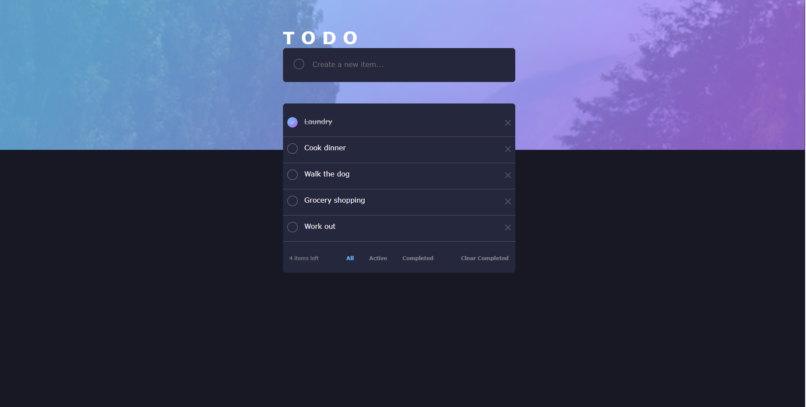

# JSToDo

## Table of contents

- [Overview](#overview)
  - [The challenge](#the-challenge)
  - [Screenshot](#screenshot)
  - [Links](#links)
- [My process](#my-process)
  - [Built with](#built-with)
  - [What I learned](#what-i-learned)
  - [Continued development](#continued-development)
  - [Useful resources](#useful-resources)
- [Author](#author)
- [Acknowledgments](#acknowledgments)


## Overview

### The Challenge

Your users should be able to:

- View the optimal layout for the application depending on their device's screen size.
- See hover states for all interactive elements on the page.
- Add new todo items to the list.
- Mark todo items as complete.
- Filter by all / active / complete todo items.
- Clear all completed todo items.

### Screenshot




### Accessing Code

- Live Site URL: [Github Pages](https://teiggam.github.io/JSToDo/index.html)
- Click the green "Code" button to either download code or open to Visual Studio

## My process

### Tech Used

- JavaScript
- HTML
- CSS
- IDE: VS Code

### What I Learned

I would like to preface this project with one statement:  I would not, in any scenario, call myself a frontend developer at this time in my career.  The majority of my training in C#, .NET, and SQL.  The frontend knowledge I have learned through Grand Circus is remedial HTML/CSS and JavaScript, and more in-depth Angular/Typescript. There were many times when I literally said outloud "If this was Angular, I would know how to do it."  But this challenge was not Angular.  This challenge was JavaScript.
That being said, I am incredibly proud of the code I was able to accomplish.  I started by watching a Youtube video on how to make a todo list with JavaScript.  It enabled me to get basic functionality. 

I am particularly excited that I figured out a way to filter the list and have the active list button change and stay blue, using the following functions.

```js
//Functions to have filtered lists and update button color
function completedToDoList(){
    changeBlue("completed");
    document.getElementById("list").innerHTML = "";
    loadCompleted(listArray, "completed");
}

function activeToDoList() {
    changeBlue("active");
    document.getElementById("list").innerHTML = "";
    loadActive(listArray, "active");
}

function showAllList() {
    changeBlue("all");
    document.getElementById("list").innerHTML = "";
    loadList(listArray, "all");
}
```


### Continued Development

JavaScript is a language that I need to learn more about and I'm absolutely eager for the chance.  Starting this project, I had a small amount of vanilla JS experience.  Most of my previous frontend coding was done via Angular and Typescript.  I've had a lot of fun learning new things.  I'm sure there are better and more efficient ways to code this project, and I'd love to learn those. Additionally, I could think I could benefit from learning more about mobile functionality and having HTML/CSS more responsive to different screen sizes.

### Useful resources

- [Code Explained Youtube](https://www.youtube.com/watch?v=b8sUhU_eq3g) - This video was useful to helping this JS beginner make a to do list.


## Author

[Maggie Tamanini](https://linkedin.com/in/deiggam)


## Acknowledgments

- I would like to thank Youtube and Stack Overflow for helping me even get this far on this challenge. 
- I'd also like to thank [Kate Datema](https://github.com/KateDatema) for assistance with bouncing off ideas and bugs.


